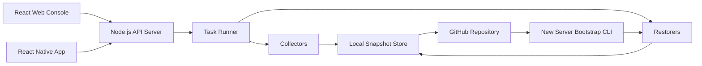

# 项目蓝图

## 2026-05-19 重要修正

本项目核心不再按 Git/GitHub 配置仓库来理解，而是按“自托管虚拟机/服务器配置管理网站”来构建。

运行中的服务器提供 Web UI 和 API，用户通过浏览器登录后，可以用 SSH、WinRM、Docker context 等方式连接当前电脑或目标虚拟机，管理目标机器的软件、硬件、系统配置，并选择把某个用户上传或保存的配置整合到当前连接的虚拟机。

Git 功能不是当前核心需求，不需要实现 Git 来管理各种配置信息。后续如需要版本历史，可以由数据库或对象存储承担。

## 我对需求的理解

用户希望生成一个 GitHub 项目，用来记录当前 Fool 服务器或个人电脑中的软件、硬件、系统配置和应用配置。这个项目本身是一个网站应用，用户可以在网页中自主选择要同步哪些内容。项目被推送到 GitHub 后，新服务器即使没有任何已部署服务，也能先从 GitHub 拉取该项目，执行一组初始化命令，然后根据用户身份和选择把 GitHub 中保存的配置同步回来，并启动后端服务继续提供网站功能。

这个项目不是简单的 dotfiles 仓库，也不是只备份文件。它更像一个“服务器配置版本控制与还原平台”：采集本机状态，生成结构化清单，安全地保存可还原配置，支持跨机器对比，支持新机器 bootstrap，支持后续多台服务器继续上传和更新配置。

## 产品目标

- 发现：自动识别系统、硬件、软件包、开发环境、运行时、服务、环境变量、Shell 配置、编辑器配置、容器配置和项目级配置。
- 选择：用户可以在 Web UI 中勾选同步范围，例如 Node/npm 全局包、Git 配置、VS Code 配置、Docker 镜像列表、系统服务清单等。
- 保存：将结构化 manifest 和允许进入仓库的配置文件保存到 GitHub。
- 对比：展示当前服务器与 GitHub 最新配置之间的差异。
- 还原：在新服务器上执行 dry-run、安装软件、恢复配置、启动后端。
- 审计：记录每次采集、同步、还原的时间、机器、用户、变更和结果。
- 扩展：通过插件式 collector/restorer 支持 Windows、Linux、macOS 以及不同包管理器。

## 非目标

- 不做完整磁盘镜像备份。
- 不默认备份个人隐私数据、浏览器数据、密码库、SSH 私钥或云服务令牌。
- 不绕过系统权限自动修改高危系统设置。
- 不承诺跨操作系统 100% 等价还原，而是尽量生成可解释、可选择、可回滚的还原计划。

## 推荐项目名称

暂定：`fool-server-restore`

可以后续替换为更正式的名称，例如：

- `ServerSnapshot`
- `ConfigHarbor`
- `MachineMirror`
- `EnvForge`

## 技术栈

- Runtime：Node.js 20+
- 后端框架：NestJS 或 Fastify
- Web 前端：React + Vite
- 移动端：React Native + Expo
- 数据库：SQLite 起步，后续可切 PostgreSQL
- 后台任务：BullMQ 或轻量本地队列
- 配置格式：JSON/YAML manifest
- Git 集成：simple-git 或 Node child_process 调用 git
- 加密：libsodium 或 Node crypto，敏感配置只保存加密文件
- 鉴权：本地管理员账号 + GitHub OAuth 或 GitHub token

## 高层架构



## 主要模块

- `apps/api`：Node.js 后端，提供 REST/WebSocket API、任务编排和权限控制。
- `apps/web`：React 控制台，管理节点、同步范围、差异和任务日志。
- `apps/mobile`：React Native 移动端，提供审批和状态查看。
- `packages/core`：共享类型、manifest schema、配置 diff、脱敏规则。
- `packages/collectors`：采集器集合，负责读取系统状态。
- `packages/restorers`：还原器集合，负责执行安装和配置恢复。
- `packages/cli`：新服务器 bootstrap 和无 UI 场景下的命令行工具。
- `configs/snapshots`：提交到 GitHub 的结构化快照。
- `configs/files`：允许同步的配置文件副本。
- `docs`：设计、流程、操作手册和安全说明。

## 建议目录结构

```text
fool-server-restore/
  apps/
    api/
    web/
    mobile/
  packages/
    core/
    collectors/
    restorers/
    cli/
  configs/
    snapshots/
    files/
    policies/
  scripts/
    bootstrap.ps1
    bootstrap.sh
  docs/
  package.json
  pnpm-workspace.yaml
  README.md
```

## 采集器设计

每类配置由一个 collector 负责，collector 只输出结构化数据，不直接修改系统。

候选 collector：

- `system-info`：OS、架构、主机名、CPU、内存、磁盘概要。
- `node-env`：Node/npm/pnpm/yarn/bun 版本，全局包清单。
- `git-config`：Git 版本、全局配置、已配置 credential helper 类型。
- `package-managers`：winget、scoop、choco、apt、dnf、brew 等包列表。
- `shell-config`：PowerShell profile、bash/zsh/fish 配置。
- `editor-config`：VS Code 扩展和 settings。
- `docker-config`：Docker 版本、镜像清单、compose 项目清单。
- `services`：系统服务清单和开机启动项。
- `env-vars`：环境变量名和可选值，敏感值默认脱敏。
- `ssh`：只记录公钥、Host alias 和安全摘要，不记录私钥。

## 还原器设计

每类配置由 restorer 负责，必须支持：

- `plan`：生成还原计划。
- `dryRun`：不修改系统，只展示将执行的操作。
- `apply`：执行还原。
- `rollbackHint`：给出回滚提示或自动回滚脚本。
- `verify`：验证还原结果。

## 网站核心页面

- 仪表盘：服务器节点、最近同步、失败任务、GitHub 状态。
- 同步范围：以分类树选择需要采集和提交的内容。
- 快照列表：查看每次采集结果、来源机器和提交版本。
- 差异对比：当前机器 vs GitHub 最新配置。
- 还原向导：选择目标快照，dry-run，确认执行。
- 任务日志：实时展示采集、提交、拉取、还原、验证过程。
- 安全策略：敏感路径、脱敏规则、允许同步的文件白名单。

## 安全边界

- 默认拒绝同步密钥、令牌、密码、Cookie、私钥。
- 允许用户显式开启加密同步，但必须先配置主密码或外部 KMS。
- GitHub 中保存的敏感文件必须是加密后的密文。
- 所有系统修改都需要生成计划并由用户确认。
- Windows 下需要管理员权限的操作必须标记清楚。
- Linux 下需要 sudo 的操作必须单独列出。

## GitHub 使用方式

GitHub 仓库承担四个职责：

- 保存项目源码。
- 保存可公开审计的机器配置 manifest。
- 保存允许同步的配置文件副本。
- 提供新服务器 bootstrap 入口。

每台服务器可以用独立目录保存快照：

```text
configs/snapshots/
  users/
    alice/
      machines/
        desktop-win/
          latest.json
          2026-05-19T10-00-00Z.json
        ubuntu-prod/
          latest.json
```

## 后续实施顺序

1. 初始化 monorepo 和基础 package scripts。
2. 定义 manifest schema、同步策略和脱敏规则。
3. 实现 CLI 的 `scan`、`diff`、`restore --dry-run`。
4. 实现 Node API，把 CLI 能力暴露给 Web。
5. 实现 React Web 控制台。
6. 加入 GitHub pull/push 同步。
7. 实现 bootstrap 脚本。
8. 实现 React Native 移动端。
9. 增加更多 collector/restorer。
10. 做跨机器测试和权限边界测试。
