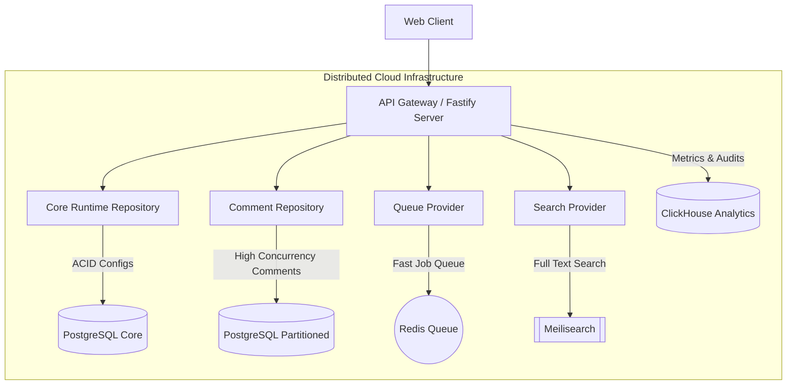

# EnvForge Architecture - Long-Term Scaling & Future Plan

This document outlines the architectural roadmap for scaling EnvForge beyond a single-node self-hosted server as traffic, package catalog contributions, and user-generated events increase. 

To ensure EnvForge can transition smoothly from its lightweight SQLite-relational hybrid engine to a distributed enterprise cloud backend without major rewrites, we establish a **strict modular boundary** using abstract interface boundaries.

---

## 🗺️ Architectural Target State

As active user and marketplace volume increases, the monolithic SQLite database will reach its scaling limits. Our long-term target is to transition individual domains to high-concurrency dedicated storage backends:



---

## 🔌 Decoupling Interfaces

To isolate database implementation details from business logic, we establish the following core architectural interfaces:

### 1. `CommentRepository`
Defines standard interactions with package comments, liking, and reporting.
```typescript
export interface CommentRepository {
  getComments(catalogId: string, limit: number, cursor?: { createdAt: string, id: string }): Promise<PaginatedComments>;
  addComment(userId: string, catalogId: string, content: string): Promise<StoredCatalogComment>;
  toggleLike(commentId: string, userId: string): Promise<boolean>;
  reportComment(commentId: string, userId: string, reason: string): Promise<void>;
  getPendingReports(): Promise<CommentReport[]>;
  resolveReport(reportId: string, action: "keep" | "delete", adminId: string): Promise<void>;
}
```

### 2. `NotificationQueueProvider`
Decouples asynchronous notification and email deliveries from direct database dependency.
```typescript
export interface NotificationQueueProvider {
  push(userId: string, type: "email" | "inbox", payload: any): Promise<void>;
  processNext(): Promise<boolean>;
  getQueueMetrics(): Promise<{ pending: number; failed: number }>;
}
```

### 3. `SearchProvider`
Abstracts package lookup and comment querying. This allows full-text queries to scale from simple SQL queries to indexing clusters.
```typescript
export interface SearchProvider {
  indexComment(commentId: string, content: string): Promise<void>;
  deindexComment(commentId: string): Promise<void>;
  searchComments(query: string, limit: number): Promise<string[]>; // Returns comment IDs
  searchCatalog(query: string): Promise<string[]>; // Returns catalog item IDs
}
```

### 4. `ModerationProvider`
Abstracts automated content safety, anti-abuse, and escalation thresholds.
```typescript
export interface ModerationProvider {
  evaluateContent(text: string): Promise<{ safe: boolean; reason?: string }>;
  registerReport(commentId: string): Promise<{ escalated: boolean; actionTaken?: string }>;
}
```

---

## 📐 System Subsystem Boundaries

To minimize architectural coupling, EnvForge isolates database duties into five clean subsystems. Standard backend logic must never bypass repositories to invoke direct SQL statements.

```
+-----------------------------------------------------------------------------------+
|                                Fastify Controllers                                |
+-----------------------------------------------------------------------------------+
       |                    |                    |                   |
       v                    v                    v                   v
+--------------+     +--------------+     +--------------+    +--------------+
| Persistence  |     |   Comment    |     |    Queue     |    |    Search    |
|  Subsystem   |     |  Subsystem   |     |  Subsystem   |    |  Subsystem   |
| (JSON Store) |     | (Relational) |     | (Async Jobs) |    |  (FTS / SQL) |
+--------------+     +--------------+     +--------------+    +--------------+
```

1.  **Persistence Subsystem**: Handles core runtime configs, connections, and playbooks. Utilizes the SQLite JSON document store.
2.  **Comment Subsystem**: Manages comments, likes, and abuse reports using high-efficiency SQL relational tables.
3.  **Queue Subsystem**: Orchestrates background transactions and deferred mail tasks using a reliable queue.
4.  **Search Subsystem**: Provides package catalog search. Bounded to simple, index-friendly Title search (no Chinese comment parsing under SQLite).
5.  **Moderation Subsystem**: Tracks flags, manages auto-hiding review queues, and protects community spaces.

---

## 📊 Consistency Model Matrix

We define the strict database synchronization model for each subsystem:

| Subsystem | Consistency Level | Guarantee Type | Authoritative Source of Truth |
| :--- | :--- | :--- | :--- |
| **Core Persistence** | Strong Consistency | Read-After-Write | `system_kv` (Primary Document Row) |
| **Comments / Likes** | Strong Consistency | Read-After-Write | `catalog_comments` Table |
| **User Lookups** | Eventual Consistency | Cache Mirror | Serialized core users array in `system_kv` (Read-Only Mirror, do not mutate directly) |
| **Search Subsystem** | Eventual Consistency | Sync Queue Processing | Relational databases |
| **Notifications Queue**| Eventual Consistency | At-Least-Once Delivery | `notification_queue` Table |

---

## ⚖️ Capacity Boundaries & Scaling Limits

The SQLite hybrid Relational-Document engine has defined capacity limits. Crossing these limits triggers a scheduled migration to PG/Redis:

| Indicator | SQLite Target Limit | Mitigation / Scaling Trigger |
| :--- | :--- | :--- |
| **Market Comments** | **1,000,000** records | Migrate comment tables to PostgreSQL |
| **Daily Transactions** | **50,000** writes / day | Migrate queue and comments to PG/Redis |
| **Write Concurrency** | **50** writes / second | Migrate lock manager to PostgreSQL |
| **Queue Backlog** | **100,000** pending events | Migrate `NotificationQueue` to Redis |

---

## 🔄 Subsystem Lifecycles & Shutdown Sequence

To guarantee transactional integrity, background jobs and database connections adhere to a strict asynchronous runtime sequence (`WorkerRuntime`):

### 1. Startup Lifecycle
1.  **Lock Acquisition**: Database migrator attempts an immediate transaction write lock on `schema_migrations` to check version and hashes.
2.  **Integrity Validation**: Computes MD5/SHA-256 hashes of local migration files and compares them with stored SQL records. Boot halts immediately on drift.
3.  **Engine Boot**: `better-sqlite3` initialized with WAL, synchronous normal, and foreign keys active.
4.  **Worker Initialization**: Central `BackgroundTaskScheduler` triggers queue processors and incremental search workers.

### 2. Asynchronous Shutdown Sequence
On process `SIGTERM` or `SIGINT`:
1.  **Worker Pause**: Background queues and search indexes immediately transition status to `'paused'`, rejecting any new pending events.
2.  **Flush Active Jobs**: Scheduler blocks thread termination up to `5000ms` allowing currently active processing transactions (emails/FTS indexing) to complete.
3.  **Active Checkpoint**: Flushes database modifications safely from WAL to disk via `PRAGMA wal_checkpoint(TRUNCATE);`.
4.  **Close Handler**: Closes database connection handles and calls `process.exit(0)`.

---

## 📖 Operational Playbook (数据库运维指南)

### 🚨 Alert 1: WAL Log File Bloat (WAL 文件无限膨胀)
*   **Root Cause**: Persistent open transaction blocks automatic WAL checkpoints, or extreme write load.
*   **Resolution Script**:
    1. Check for long-running target connection SSH playbooks.
    2. Force an active checkpoint immediately in the terminal:
       ```sql
       PRAGMA wal_checkpoint(TRUNCATE);
       ```
    3. If WAL file remains massive, verify no orphaned worker processes are locking the database.

### 🚨 Alert 2: Search Index Drift (全文检索索引失效)
*   **Root Cause**: Asynchronous FTS scheduler crashed or database crashed during index synchronization.
*   **Resolution Script**:
    1. Reset the `fts_sync_queue` table statuses:
       ```sql
       UPDATE fts_sync_queue SET status = 'pending', attempts = 0 WHERE status = 'failed';
       ```
    2. Trigger manual re-index of comments:
       ```sql
       INSERT OR IGNORE INTO fts_sync_queue (id, comment_id, status, next_retry_at, created_at)
       SELECT id, id, 'pending', datetime('now'), datetime('now') FROM catalog_comments;
       ```
    3. Re-run search indexing task through the scheduler.

### 🚨 Alert 3: Asynchronous Queue Backlog (消息队列严重积压)
*   **Root Cause**: SMTP host timeout, external provider failure, or high traffic comments flood.
*   **Resolution Script**:
    1. Query metrics from standard endpoint to determine failed retry distributions:
       ```sql
       SELECT status, COUNT(*) FROM notification_queue GROUP BY status;
       ```
    2. If SMTP connection is down, resolve SMTP host setup.
    3. Retry poison messages (Dead-Letter queue items) manually once host connection recovers:
       ```sql
       UPDATE notification_queue SET status = 'pending', attempts = 0, next_retry_at = datetime('now')
       WHERE status = 'dead_letter';
       ```
